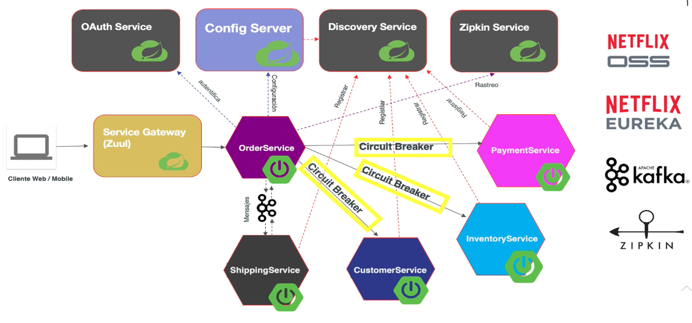
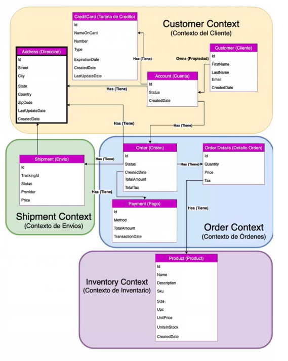

## Introducción 🚀

Desarrollar microservicios utilizando la popular plataforma de Spring Boot, fomentando las bases del desarrollo rápido de aplicaciones con Java, al finalizar este curso serás capaz de desarrollar conceptos esenciales para implementar soluciones en Microservicios.

## Contenido 🛠️
Qué son los Microservicios:
Obtén un vistazo general sobre la teoría de los microservicios, desde cómo evolucionaron, que es un Monolito (Monolith) y las 12 factores a considerar para desarrollar microservicios.

Proyecto a Desarrollar GeekShirt:
Vamos a ver los requisitos de GeekShirt una tienda en linea que vende camisas con las imagenes geeks del momento, y conocer su necesidad de pasar de una aplicación monolítica, a una aplicación basada en arquitectura de Microservicios. Haremos un vistazo al proyecto que vamos a desarrollar y sus dependencias.

Manos a la Obra con Spring Boot
Unete al desarrollo ágil con Spring Boot, en esta unidad vamos a desarrollar los microservicios de GeekShirt con este popular framework.

Pruebas en Microservicios
Aprende como dar certidumbre a tus microservicios, y  funcionen con el comportamiento esperado, hablaremos de los diferentes tipos de pruebas.

* Pruebas Unitarias
* Pruebas de Integración

## Arquitectura 🛠️

## Base de Datos 🛠️
